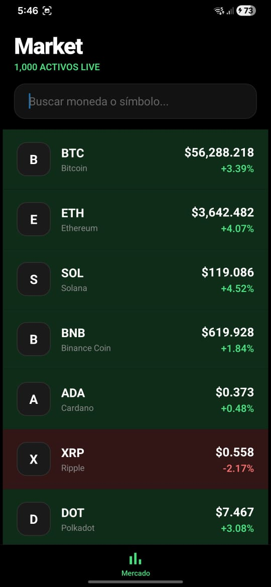
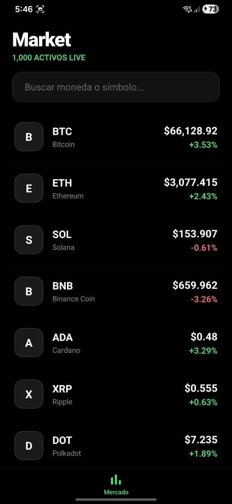
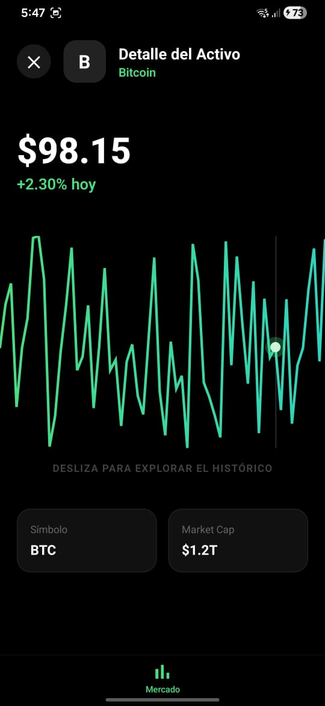
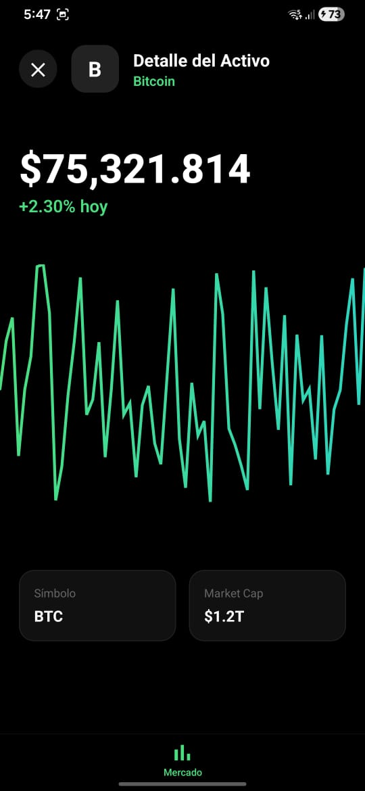

# The Performance Showcase: Crypto Market Dashboard 🚀

## 📱 App Preview

  
  
  
  
  
<i>Interfaz Dark Premium con renderizado de alto rendimiento a 60 FPS.</i>

---

## 📋 Objetivo del Proyecto

"The Performance Showcase" es un panel financiero de alta fidelidad diseñado para demostrar el dominio técnico en **optimización de renderizado masivo** e **interactividad de baja latencia**. El proyecto aborda el reto de manejar flujos de datos constantes (1,000+ activos) manteniendo una interfaz fluida mediante el uso de hilos de UI dedicados y renderizado por GPU.

## 🏗️ Arquitectura: Feature-Driven Development (FDD)

El proyecto sigue una estructura organizada por funcionalidades para maximizar la escalabilidad:

1.  **Market Feature:** Gestión de listas infinitas mediante `FlashList`. Implementa un motor de búsqueda filtrado en memoria con `useMemo` para evitar bloqueos del hilo principal.
2.  **Details Feature:** Visualización profunda de activos. Utiliza **Shared Values** para comunicar componentes sin causar re-renders en el árbol de React.
3.  **Core UI Module:** Componentes de alto nivel como _Skeleton Loaders_ con gradientes animados (Shimmer Effect) y gestión de _Safe Area Insets_.

## 📡 Estrategia High-Performance Stack

La aplicación destaca por tres pilares de ingeniería avanzada:

- **Zero-Jank List:** Renderizado de 1,000 elementos a 60 FPS constantes. Se eliminó el "blanking" mediante el reciclaje de vistas de `FlashList` y la optimización de `memo` y `useCallback` en cada item.
- **GPU Accelerated Graphics:** Gráficos interactivos construidos con **Shopify Skia**. El cursor y el precio dinámico se calculan y actualizan en el hilo de la UI usando `useDerivedValue` y `AnimatedTextInput`, permitiendo interactividad sin latencia de JavaScript.
- **Shared Element Transitions:** Micro-interacción fluida que transfiere el icono del activo desde la lista hasta la pantalla de detalle mediante una arquitectura de capas (Layered Rendering) para mantener la continuidad visual.

## 🛠️ Stack Tecnológico

- **Core:** React Native (Expo SDK 54) + TypeScript.
- **Performance List:** Shopify FlashList.
- **Graphics:** Shopify React Native Skia.
- **Animations:** React Native Reanimated 3 + Gesture Handler.
- **Data Fetching:** TanStack Query (React Query).
- **UI/UX:** Expo Linear Gradient, Safe Area Context.

## 🚀 Instalación y Uso

1. Clonar el repositorio.
2. Instalar dependencias: `npm install`
3. Instalar librerias nativas de Expo: `npx expo install`
4. Iniciar app: `npx expo start`

**Desarrollado con un enfoque obsesivo en el rendimiento y la experiencia de usuario (UX) de grado financiero.**
